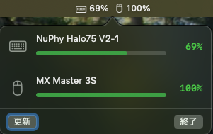

# BatteryBar

Bluetooth で接続しているマウス・キーボードのバッテリー残量を macOS のメニューバーに表示するアプリです。



## 機能

- Bluetooth 接続中のマウス・キーボードのバッテリー残量をメニューバーに表示
- クリックで各デバイスの詳細と残量バーを表示
- 60秒ごとに自動更新

## 動作環境

- macOS 13 以降

## インストール

1. [Releases](../../releases) から最新の `BatteryBar.zip` をダウンロード
2. 解凍して `BatteryBar.app` をアプリケーションフォルダへ移動
3. 初回起動時は右クリック →「開く」を選択

## ビルド

```
Xcode 16 以降で BatteryBar.xcodeproj を開いてビルド
```

## ライセンス

MIT
